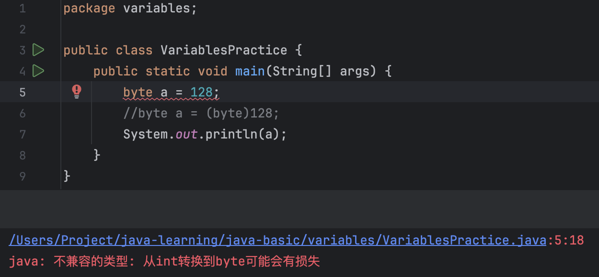
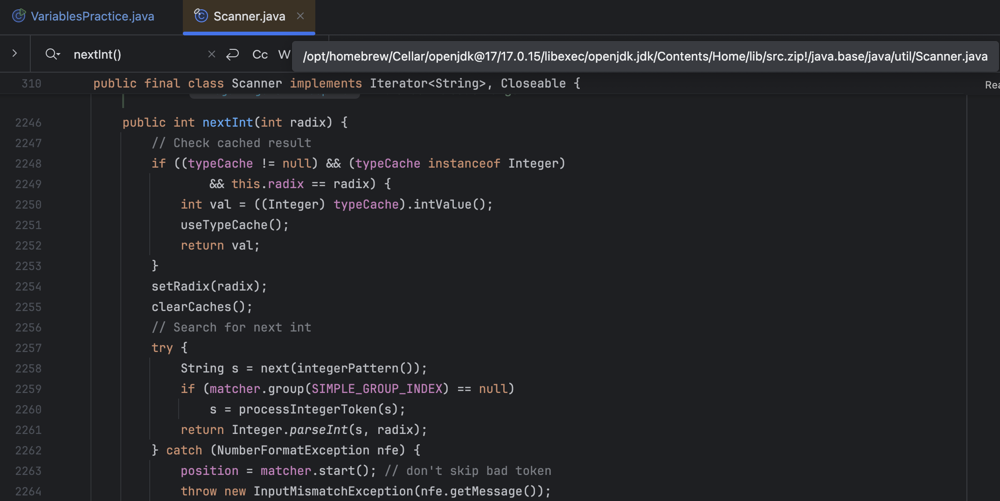
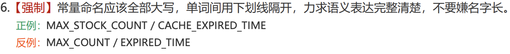
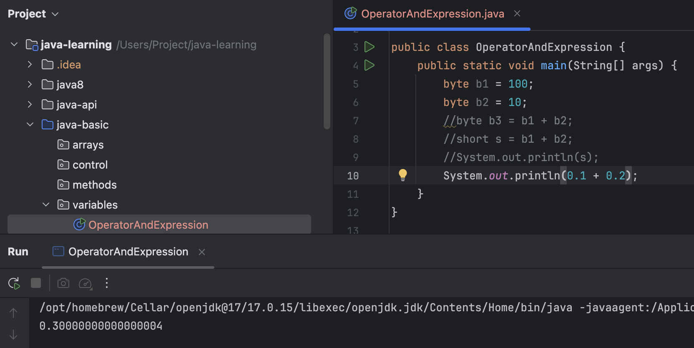
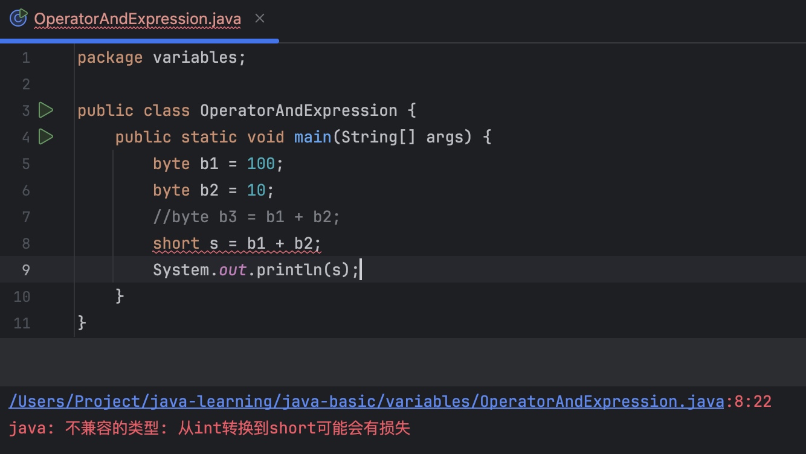
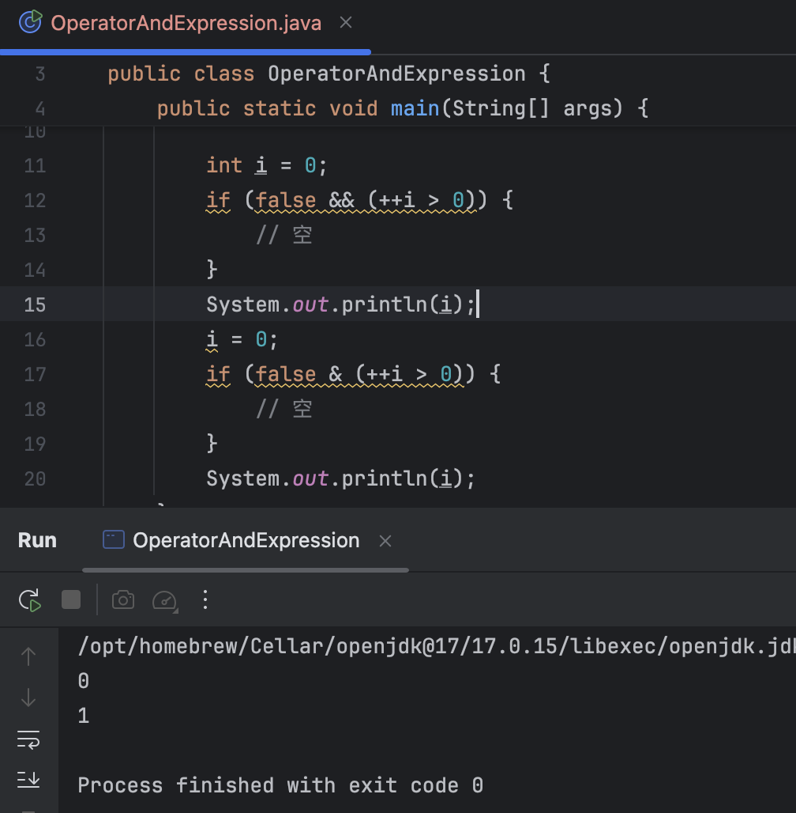

# 数据类型

## 基本数据类型

| 数据类型 | 关键字  | 内存占用 |                 取值范围                  |
| :------: | :-----: | :------: | :---------------------------------------: |
|   整数   |  byte   |    1     |    负的2的7次方 ~ 2的7次方-1(-128~127)    |
|          |  short  |    2     | 负的2的15次方 ~ 2的15次方-1(-32768~32767) |
|          |   int   |    4     |        负的2的31次方 ~ 2的31次方-1        |
|          |  long   |    8     |        负的2的63次方 ~ 2的63次方-1        |
|  浮点数  |  float  |    4     |        1.401298e-45 ~ 3.402823e+38        |
|          | double  |    8     |      4.9000000e-324 ~ 1.797693e+308       |
|   字符   |  char   |    2     |                  0-65535                  |
|   布尔   | boolean |    1     |                true，false                |

byte类型取值范围：-128~127

int类型取值范围：-21亿多～21亿多

大小关系：double>float>long>int>short>byte

Java整数溢出：



字面量128为int类型，变量a为byte类型，报编译错误。(byte)128表示强制类型转换，将int类型的128转换为byte类型，128的二进制数为1000 0000（前置0省略，共32位），二进制截断得到最低八位1000 0000，计算机底层采用二进制补码存储数字，八位二进制补码中1000 0000表示-128。关于补码，详见[链接](https://www.cnblogs.com/lf109/p/19299619)。

## 引用数据类型


## 如何在IDEA中阅读Java类库源码？

Command + 点击类名，IDEA自动解析.../lib/src.zip路径下对应类的源码。

```
src.zip
 └── java.base  <-- (JDK 9+ 引入的模块层级)
      └── java  <-- 文件夹
           └── util  <-- 文件夹
                ├── Scanner.java  <-- 这就是那个文件！
                ├── ArrayList.java
                ├── Date.java
                └── ...
```




## 命名规范

变量名小驼峰，类名大驼峰（DO、PO、VO等除外），字面量大写且用'_'分隔单词。

开头、结尾不要用'$'和'_'。




# 运算符和表达式

## 除法运算符“/”：

整数除法：两个整型数相除会**舍弃**结果的**小数部分**，除非操作数中有小数。

浮点数除法：结果是近似值，可能**不精确**，例如 `10.0 / 3 = 3.3333333333333335`，因为计算机用有限位存储小数，无法精确表示某些十进制小数，又如`0.1 + 0.2 != 0.3`。

因此在金融计算等需要**高精度计算**的场景，使用能够进行精确小数计算的**BigDecimal类**。



## 类型转换

* 隐式类型转换：byte、short、char类型在表达式中参与运算时，先隐式转换为int类型，再进行计算。

  当把大范围类型赋值给小范围类型变量时，可能出现损失（即截断导致数值变化），报编译错误。

* 强制类型转换：目标数据类型 变量名 = （目标数据类型）被强转的数据；

  `(byte)128` 强制将int类型字面量128转换为byte类型，得到-128。



## “+”运算符

多个“+”构成的表达式，**从左至右**计算，有**String**参与进行**拼接**，有char参与就将**char转换为int**类型（根据ASCII码）。

（1）操作数有String类型

```java
1 + 2 + "abc" + 2 + 1
```

结果：“3abc21”

（2）操作数有char类型

```java
1 + ‘A’ + "abc" + 2 + 1
```

结果：“66abc21”

- **数字 `0`到 `9`**：对应的 ASCII 码范围是 **48 到 57**。
- **大写字母 `A`到 `Z`**：对应的 ASCII 码范围是 **65 到 90**。
- **小写字母 `a`到 `z`**：对应的 ASCII 码范围是 **97 到 122**。

## 逻辑运算符

（1）&& 与 &

* &&的两个操作数只能是**布尔类型**，且均为true时结果才为true，存在**逻辑短路**：当&&左侧表达式值为false时，不再执行右侧的表达式。
* &两侧操作数为布尔类型时，两个操作数均为true时结果为true，**无逻辑短路**；&两侧操作数为int类型时，执行**按位与**运算。

（2）||与|

类比&& 与 &。



## 三元运算符

三元表达式或者问号冒号表达式，存在短路。

格式：

​	关系表达式 ？ 表达式1 ：表达式2 ；

计算规则：

* 计算关系表达式的值。
* 如果关系表达式的值为真，那么执行表达式1。
* 如果关系表达式的值为假，那么执行表达式2。

# 流程控制语句

（1）**switch**

```java
switch (表达式) {
	case 1:
		语句体1;
		break;
	case 2:
		语句体2;
		break;
	...
	default:
		语句体n+1;
		break;
}
```

- 首先计算出表达式的值 。
- 其次，和case依次比较，一旦有对应的值，就会执行相应的语句，在执行的过程中，遇到break就会结束。 
- 最后，如果所有的case都和表达式的值不匹配，就会执行default语句体部分，然后程序结束掉。 

- default可以放在任意位置，也可以省略。

- case穿透

  不写break会引发case穿透现象。

- switch在JDK12的新特性

```java
int number = 10;
switch (number) {
    case 1 -> System.out.println("一");
    case 2 -> System.out.println("二");
    case 3 -> System.out.println("三");
    default -> System.out.println("其他");
}
```

- switch和if第三种格式各自的使用场景

当我们需要对一个范围进行判断的时候，用多分枝if语句。

当我们把有限个数据列举出来，选择其中一个执行的时候，用switch语句。

（2）for与while如何选择？

明确循环次数用for，循环次数不确定但明确循环终止条件用while。